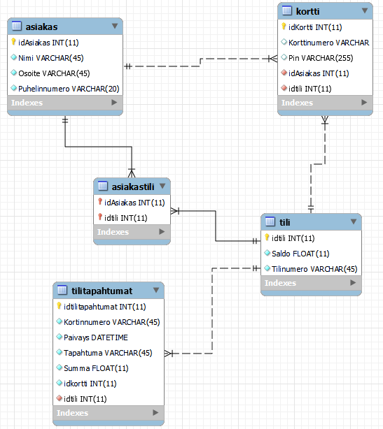

# group17   |   ATM-Software-project

## Installation // Asennusohje
In api folder execute npm install. Then start the app with npm start
aja api kansiossa komento npm install. Sitten sovellus käynnistyy komennolla npm start

### .env

Create .env file in api folder and write MY_TOKEN= in it.
On command line execute  node create_token.js and copy the token to MY_TOKEN=. eg. MY_TOKEN=1234abc567
Luo api kansioon tiedosto .env ja kirjoita sinne muuttuja nimeltään MY_TOKEN=.
Aja komentoriviltä komento node create_token.js ja kopsaa "token" muuttujaan MY_TOKEN=

### Database // Tietokanta

Create the database with "database_dump.sql" and execute the following command
Suorita tuo tiedosto "database_dump.sql" ja aja komennot 
<b>
CREATE USER 'netuser'@'localhost' IDENTIFIED WITH mysql_native_password BY 'netpass'
GRANT ALL ON banksimuldb.* to 'netuser'@'localhost';
<b>

## ER-Diagram // ER-Kaavio

